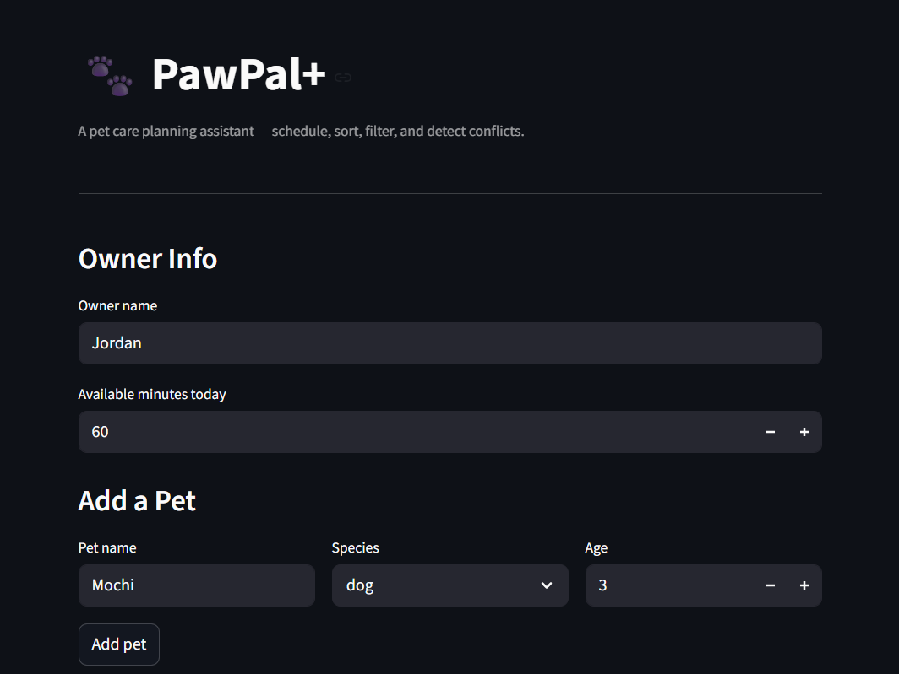
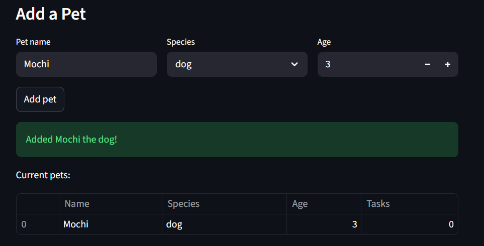
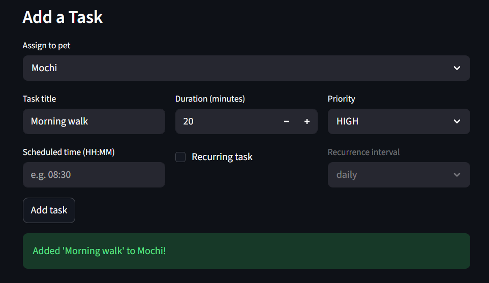
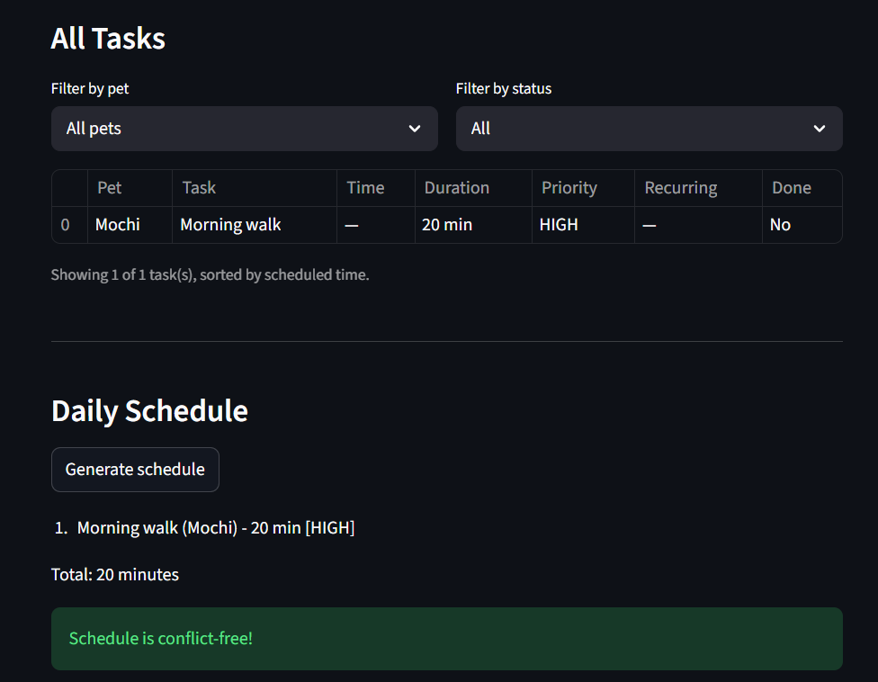

# PawPal+ (Module 2 Project)

**PawPal+** is a Streamlit app that helps a pet owner plan daily care tasks for one or more pets. It was designed UML-first, implemented in Python, and wired to an interactive UI.

## Demo

### Owner Setup and Pet Registration


Set your name and daily time budget, then add pets with name, species, and age.

### Initial State — No Pets Yet


Before any pets are added, the app prompts you to add a pet first before creating tasks.

### Pet Added Successfully


After adding a pet, a success banner confirms the addition and a table displays all registered pets.

### Task Creation


Create tasks with a title, duration, priority level, optional scheduled time, and recurrence settings.

### Task Table, Filtering, and Schedule Generation


View all tasks in a sortable, filterable table. Generate a daily schedule with conflict detection — a green banner confirms the schedule is conflict-free.

## Features

### Core Data Model
- **Owner** — stores the owner's name, daily time budget (`available_minutes`), and a list of pets
- **Pet** — stores name, species, age, and an associated task list. Handles task lifecycle including recurring task auto-scheduling via `complete_task()`
- **Task** — each task carries a title, duration, priority, optional scheduled time (`HH:MM`), and recurrence settings. Implemented as a `@dataclass` with `dataclasses.replace` for immutable next-occurrence creation
- **Priority (`IntEnum`)** — `LOW=1`, `MEDIUM=2`, `HIGH=3`. Numeric values enable direct comparison for greedy scheduling sort order

### Scheduling Algorithm
- **Greedy knapsack** (`Scheduler.generate_schedule`) — collects all incomplete tasks across every pet, sorts descending by `Priority` value, and greedily packs tasks into the owner's available minutes until the budget is exhausted
- **Human-readable explanation** (`Scheduler.explain_schedule`) — produces a numbered summary with per-task details (pet, date, time, duration, priority, recurrence) and a total-minutes footer

### Sorting and Filtering
- **Chronological sort** (`sort_by_time`) — sorts tasks by `HH:MM` using a `(bool, str)` tuple key so that tasks without a time slot are pushed to the end while timed tasks sort lexicographically
- **Filter by pet** (`filter_by_pet`) — narrows a task list to a single pet by matching `pet_name`
- **Filter by status** (`filter_by_status`) — splits tasks into pending or completed subsets

### Recurring Tasks
- **Automatic rescheduling** (`Task.mark_completed`) — when a recurring task is completed, `timedelta` calculates the next occurrence date using `INTERVAL_DAYS` (daily=1, weekly=7, biweekly=14, monthly=30) and returns a new `Task` instance via `dataclasses.replace`
- **Pet-level integration** (`Pet.complete_task`) — marks the task done and appends the next occurrence directly to the pet's task list

### Conflict Detection
- **Pairwise overlap check** (`Scheduler.detect_conflicts`) — converts `HH:MM` strings to minutes, precomputes start/end windows, and compares every pair of timed tasks. An early break on the sorted list skips impossible overlaps
- **Labelled warnings** — each conflict is classified as "Same-pet conflict" (one pet, two overlapping tasks) or "Owner conflict" (different pets, same owner time slot). Malformed times are silently skipped

### Streamlit UI
- Owner setup with configurable daily time budget
- Multi-pet support with duplicate-name prevention
- Task creation with time, priority, and recurrence controls
- Live filtering by pet and completion status with sorted table display
- Conflict detection banner (`st.warning` / `st.success`) shown inline after tasks and after schedule generation
- Recurring tasks summary in a collapsible expander

### Smarter Scheduling

The Scheduler in `pawpal_system.py` goes beyond basic priority sorting with these features:

- **Sort by time** (`sort_by_time`) — Orders tasks chronologically by HH:MM using a lambda key; tasks without a time slot are pushed to the end.
- **Filter by pet or status** (`filter_by_pet`, `filter_by_status`) — Narrow a task list by pet name or completion state using list comprehensions.
- **Recurring tasks** (`mark_completed`, `complete_task`) — When a recurring task is completed, `timedelta` calculates the next occurrence date (daily, weekly, biweekly, or monthly) and a new Task instance is auto-added to the pet's list.
- **Conflict detection** (`detect_conflicts`) — Compares every pair of timed tasks using precomputed start/end minutes. Labels overlaps as "Same-pet conflict" or "Owner conflict" (cross-pet). An early break on the sorted list avoids unnecessary comparisons. Malformed times are skipped gracefully.

## Getting Started

### Setup

```bash
python -m venv .venv
source .venv/bin/activate  # Windows: .venv\Scripts\activate
pip install -r requirements.txt
```

### Running the Streamlit App

```bash
streamlit run app.py
```

The app will open in your browser at `http://localhost:8501`. From there you can add pets, create tasks, and generate a daily schedule.

### Testing PawPal+

Run the test suite:

```bash
python -m pytest tests/test_pawpal.py -v
```

#### Sorting (Confidence: 5/5)

| Test | What it covers |
|------|---------------|
| `test_sort_by_time_chronological_order` | Tasks added out of order are returned in correct HH:MM sequence |
| `test_sort_by_time_no_time_goes_last` | Tasks with no scheduled time are placed at the end of the sorted list |

Both tests are deterministic with no external dependencies. The lambda key logic is straightforward to verify.

#### Recurring Tasks (Confidence: 5/5)

| Test | What it covers |
|------|---------------|
| `test_recurring_daily_creates_next_day` | Completing a daily task creates a new instance dated tomorrow via `timedelta(days=1)` |
| `test_recurring_weekly_creates_next_week` | Completing a weekly task creates a new instance dated 7 days later |
| `test_non_recurring_returns_none` | Completing a non-recurring task returns `None` (no next occurrence) |
| `test_complete_task_adds_next_to_pet` | `Pet.complete_task` appends the next occurrence to the pet's task list automatically |

Date arithmetic is handled entirely by `timedelta`, which is well-tested in the Python standard library. Each interval mapping is verified independently.

#### Conflict Detection (Confidence: 4/5)

| Test | What it covers |
|------|---------------|
| `test_same_pet_conflict_detected` | Two overlapping tasks for the same pet are flagged as "Same-pet conflict" |
| `test_cross_pet_conflict_detected` | Two overlapping tasks for different pets are flagged as "Owner conflict" |
| `test_no_conflict_when_times_dont_overlap` | Non-overlapping tasks produce zero conflicts |

Scored 4/5 because the current tests cover two-task pairs. More complex scenarios (three-way overlaps, tasks that share an exact end/start boundary) would raise confidence further.

#### Edge Cases (Confidence: 5/5)

| Test | What it covers |
|------|---------------|
| `test_schedule_with_no_tasks` | A pet with no tasks produces an empty schedule |
| `test_schedule_skips_completed_tasks` | Completed tasks are excluded from the generated schedule |
| `test_schedule_respects_time_budget` | Tasks that would exceed the remaining time budget are skipped |
| `test_conflict_detection_skips_malformed_time` | Malformed time strings (e.g. `"not-a-time"`) are skipped without crashing |

These guard against the most common failure modes: empty inputs, stale data, and bad user input.

#### Filtering (Confidence: 5/5)

| Test | What it covers |
|------|---------------|
| `test_filter_by_pet` | `filter_by_pet` returns only tasks matching the given pet name |
| `test_filter_by_status` | `filter_by_status` correctly splits tasks by completed vs. pending |

Simple list comprehension logic with clear inputs and outputs.
