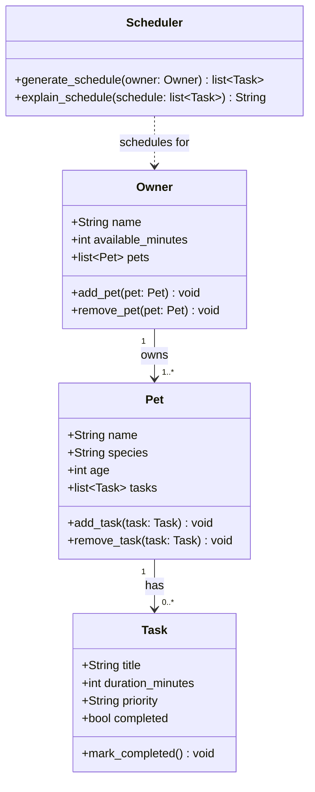

# PawPal+ UML Class Diagram

```mermaid
classDiagram
    class Owner {
        +String name
        +int available_minutes
        +list~Pet~ pets
        +add_pet(pet: Pet) void
        +remove_pet(pet: Pet) void
    }

    class Pet {
        +String name
        +String species
        +int age
        +list~Task~ tasks
        +add_task(task: Task) void
        +remove_task(task: Task) void
    }

    class Task {
        +String title
        +int duration_minutes
        +String priority
        +bool completed
        +mark_completed() void
    }

    class Scheduler {
        +generate_schedule(owner: Owner) list~Task~
        +explain_schedule(schedule: list~Task~) String
    }

    Owner "1" --> "1..*" Pet : owns
    Pet "1" --> "0..*" Task : has
    Scheduler ..> Owner : schedules for
```
