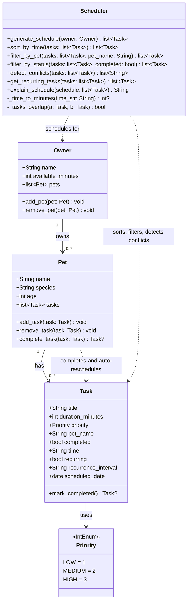

# PawPal+ Final UML Class Diagram

## Changes from Phase 1

| Area | Phase 1 (Initial) | Final Implementation |
|---|---|---|
| **Task fields** | `title`, `duration_minutes`, `priority` (str), `completed` | Added `pet_name`, `time`, `recurring`, `recurrence_interval`, `scheduled_date` |
| **Task.mark_completed()** | Returns `void` | Returns `Task` or `None` (creates next occurrence for recurring tasks) |
| **Priority** | Plain string attribute on Task | Dedicated `IntEnum` class (`LOW=1`, `MEDIUM=2`, `HIGH=3`) |
| **Pet methods** | `add_task`, `remove_task` | Added `complete_task()` for recurring auto-scheduling |
| **Scheduler methods** | `generate_schedule`, `explain_schedule` | Added `sort_by_time`, `filter_by_pet`, `filter_by_status`, `detect_conflicts`, `get_recurring_tasks`, plus private helpers |
| **Module constants** | None | `INTERVAL_DAYS` dict mapping recurrence strings to day counts |

